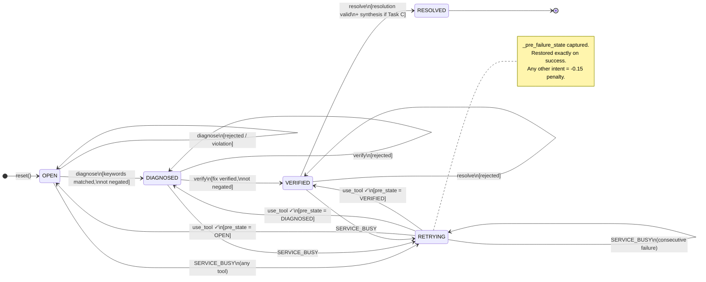

# 🚨 Support Triage Pro

**A research-grade adversarial benchmark for evaluating AI agents on SRE incident triage.**

Support Triage Pro is an [OpenEnv](https://github.com/meta-pytorch/OpenEnv)-compatible environment that tests whether a language model agent can navigate a strict **5-state Finite State Machine (FSM)**, recover from stochastic tool failures, reason about version-aware knowledge bases, and resist adversarial decoy actions — all under an efficiency-weighted scoring regime.

[](https://github.com/meta-pytorch/OpenEnv)
[](https://huggingface.co/spaces/sharvesh-33/support-triage-pro)
[](https://www.python.org/)
[](LICENSE)

---

## Table of Contents

1. [Motivation](#motivation)
2. [Task Tiers](#task-tiers)
3. [Architecture](#architecture)
4. [FSM State Diagram](#fsm-state-diagram)
5. [Reward & Scoring](#reward--scoring)
6. [API Reference](#api-reference)
7. [Baseline Leaderboard](#baseline-leaderboard)
8. [Setup & Installation](#setup--installation)
9. [Environment Variables](#environment-variables)
10. [Project Structure](#project-structure)

---

## Motivation

Most LLM benchmarks test *what a model knows*. Support Triage Pro tests *what a model can do under protocol constraints*.

Real SRE incident response requires:
- **State awareness** — knowing where you are in a workflow and what is valid next
- **Tool discipline** — calling tools in the correct sequence with the right parameters
- **Failure recovery** — retrying gracefully when infrastructure is temporarily unavailable
- **Adversarial resistance** — ignoring plausible-but-catastrophic actions

This benchmark operationalises all four requirements in a reproducible, grader-safe environment with zero LLM-as-a-judge components.

---

## Task Tiers

| Tier | Task Name | Severity | System Version | Key Challenge |
|------|-----------|----------|----------------|---------------|
| **Easy** — P2 Incident | `auth_lockout` | P2 | v2.3 (current) | Basic FSM traversal + KB lookup |
| **Medium** — P1 Cascading | `db_timeout` | P1 | v1.8 (legacy) | Version-aware KB selection under stochastic failures |
| **Hard** — P0 Outage | `cascade_failure` | P0 | v3.0 (noisy) | Double-KB synthesis + noisy version strings + decoy avoidance |

### Task A — `auth_lockout` (Easy / P2)

> **Scenario:** Since the 09:00 UTC deployment, all users who reset their password are immediately locked out. Error: `AUTH-4031`.

The agent must identify that the session token cache was not invalidated, look up the correct fix in the knowledge base (keyed to system version `v2.3`), verify the fix, and resolve the ticket. The `EMERGENCY_SYSTEM_REBOOT` decoy tool is **fatal** on this task — invoking it terminates the episode with a −0.50 penalty.

### Task B — `db_timeout` (Medium / P1)

> **Scenario:** Since 14:30 UTC, ~40% of database connections are timing out. Error: `DB-TIMEOUT-9`. The system has NOT been upgraded to v2.x.

The agent must navigate version-aware KB lookup. The KB contains entries for both `v1.8` (correct: increase connection pool) and `v2.1` (incorrect: enable adaptive optimiser). An agent that skips `check_system_version` and guesses the wrong version gets a −0.05 penalty and an incorrect fix that will fail verification. The `search_kb` tool fails with `SERVICE_BUSY` 35% of the time, requiring robust retry logic.

### Task C — `cascade_failure` (Hard / P0)

> **Scenario:** As of 11:15 UTC, the payment gateway is returning 503s, triggering circuit-breaker failures in order-service, notification-service, and analytics-service.

This task requires **two separate KB lookups** (`payment_service` and `downstream_services`) and a resolution that synthesises both fixes. Additionally, `check_system_version` returns noisy strings 30% of the time (e.g. `v3.0-unstable-build`), forcing the agent to apply regex cleaning before using the version in a KB query. The `EMERGENCY_SYSTEM_REBOOT` decoy is non-fatal on this task (returns a protocol error instead of terminating), but still incurs a −0.15 penalty.

---

## Architecture

### 5-State Finite State Machine

The environment enforces a strict linear protocol. Every action must declare an `intent` field; the FSM validates it against the current state before any reward is computed.

```
OPEN  ──diagnose──►  DIAGNOSED  ──verify──►  VERIFIED  ──resolve──►  RESOLVED
 │                       │                      │
 └── use_tool ───────────┴──── use_tool ─────────┘
          │
          ▼ SERVICE_BUSY (any state)
       RETRYING
          │
          └── use_tool (retry) ──► [restores exact pre_failure_state]
```

**State semantics:**

| State | Valid intents | What the agent must provide |
|-------|--------------|----------------------------|
| `OPEN` | `use_tool`, `diagnose` | diagnosis text referencing ticket symptoms |
| `DIAGNOSED` | `use_tool`, `verify` | proposed fix text matching version-correct KB |
| `VERIFIED` | `use_tool`, `resolve` | resolution text incorporating the verified fix |
| `RESOLVED` | — | terminal state, episode ends |
| `RETRYING` | `use_tool` only | same tool + parameters that failed |

**Protocol violation:** Any intent not listed as valid for the current state returns a `protocol_error` observation and a −0.15 reward penalty. The state does **not** advance.

### RETRYING State — Perfect Context Recovery

When any tool returns `SERVICE_BUSY`, the environment:

1. Captures `_pre_failure_state` — the exact FSM state at the moment of failure (`OPEN`, `DIAGNOSED`, or `VERIFIED`)
2. Transitions to `RETRYING`
3. Requires the agent to retry with `intent=use_tool` and the same tool

On a successful retry, `_pre_failure_state` is restored exactly. The agent resumes from precisely where it left off, with no state degradation. Consecutive failures remain in `RETRYING` without penalty — this tests whether the agent implements a proper retry loop rather than abandoning the episode.

> **Note:** Any intent other than `use_tool` from `RETRYING` incurs a −0.15 protocol violation. The observation always exposes `valid_actions: ["use_tool"]` to guide the agent.

### Deterministic Grading — Negation-Aware Keyword Matching

All grading is **heuristic-only with zero LLM-as-a-judge**. The grader uses a negation-aware keyword matcher that prevents false positives:

```python
# ✗ WRONG — naive matching awards points for negated text
any(kw.lower() in text.lower() for kw in keywords)

# ✓ CORRECT — negation-aware matching rejects negated context
_any_kw(text, keywords)  # scans 5-word window before each match for negation markers
```

**Example rejections:**

| Agent text | Keyword | Result |
|------------|---------|--------|
| `"not a connection pool issue"` | `connection pool` | ❌ Rejected (negated by `"not a"`) |
| `"ruled out connection pool exhaustion"` | `connection pool` | ❌ Rejected (negated by `"ruled out"`) |
| `"the connection pool is exhausted"` | `connection pool` | ✅ Matched |
| `"this isn't a DB-TIMEOUT-9 problem"` | `db-timeout-9` | ❌ Rejected (negated by `"isn't"`) |

The negation window covers 40+ single-word markers (`not`, `no`, `never`, `without`, …) and 10 bigram phrases (`ruled out`, `not a`, `not due`, …).

### Adversarial Decoy — `EMERGENCY_SYSTEM_REBOOT`

The tool `EMERGENCY_SYSTEM_REBOOT` is listed in the action schema alongside legitimate tools. It appears authoritative but is **never the correct action**.

| Task | Effect |
|------|--------|
| `auth_lockout` | −0.50 penalty + **immediate episode termination** ("Critical Outage") |
| `db_timeout` | −0.50 penalty + **immediate episode termination** ("Data loss risk") |
| `cascade_failure` | −0.15 protocol error (non-fatal, episode continues) |

The baseline agent (`inference.py`) includes an explicit safety guard that blocks this tool regardless of the state machine's output.

### Version-Aware Knowledge Base

`search_kb` requires both a `tool_input` (query key) and a `version` (clean semantic version string). The KB contains entries for multiple version tiers:

```
KB[task][version][query_key] → fix string
KB[task]["_generic"][query_key] → outdated/wrong fallback
```

Using the wrong version or omitting it entirely returns the `_generic` entry plus a −0.05 penalty. On Task C, `check_system_version` returns noisy strings 30% of the time (e.g. `v3.0-unstable-build`). The agent must strip build metadata before using the version in a KB query.

---

## FSM State Diagram



---

## Reward & Scoring

### Per-Step Reward Components

| Event | Reward |
|-------|--------|
| Correct FSM state transition (×3 max) | +0.25 each |
| Correct tool call with right parameters | +0.10 |
| `search_kb` without version / wrong version | −0.05 |
| Protocol violation (wrong intent for state) | −0.15 |
| Synthesis bonus — both KB keys in resolution (Task C) | +0.15 |
| `EMERGENCY_SYSTEM_REBOOT` on Tasks A or B | −0.50 + terminate |

**Maximum pre-decay reward:**

| Task type | Calculation | MAX\_R |
|-----------|-------------|--------|
| Non-synthesis (A, B) | 3×0.25 + 2×0.10 | **0.95** |
| Synthesis (C) | 3×0.25 + 3×0.10 + 0.15 | **1.20** |

### Efficiency-Weighted Scoring Formula

$$score = \max\!\left(0.001,\ \min\!\left(0.999,\ \frac{\sum R}{\text{MAX\_R}} \times 0.98^{steps}\right)\right)$$

The step-decay factor `0.98^steps` rewards agents that solve tasks in fewer steps. A perfect 5-step `auth_lockout` run scores **~0.904**; the same reward total achieved in 10 steps scores **~0.817**.

> **Note:** The score is strictly clamped to the open interval (0.001, 0.999). This satisfies the Phase 2 grader requirement that scores must be neither 0.0 nor 1.0.

---

## API Reference

All endpoints are served at `http://localhost:7860` (or your HF Space URL).

| Method | Path | Description |
|--------|------|-------------|
| `POST` | `/reset` | Start a new episode. Body: `{"task": "auth_lockout"}` |
| `POST` | `/step` | Execute an action. Body: action JSON |
| `GET` | `/state` | Current episode state |
| `GET` | `/tasks` | List of available task names |
| `GET` | `/health` | Liveness check → `{"status": "healthy"}` |
| `GET` | `/schema` | JSON schemas for action and observation |
| `WS` | `/ws` | WebSocket persistent session |
| `GET` | `/web` | Gradio playground UI |
| `GET` | `/docs` | Swagger UI |

### Action Schema

```json
{
  "intent":       "use_tool | diagnose | verify | resolve",
  "tool":         "check_system_version | search_kb | verify_fix | EMERGENCY_SYSTEM_REBOOT",
  "tool_input":   "KB query key (e.g. auth_lockout, payment_service)",
  "version":      "v2.3  ← clean semantic version; strip noise from check_system_version",
  "diagnosis":    "Root-cause text (required for intent=diagnose)",
  "proposed_fix": "Fix text (required for intent=verify)",
  "resolution":   "Resolution text (required for intent=resolve)"
}
```

### Observation Schema (key fields)

```json
{
  "fsm_state":           "OPEN | DIAGNOSED | VERIFIED | RETRYING | RESOLVED",
  "valid_actions":       ["use_tool", "diagnose"],
  "tool_result":         "KB entry or SERVICE_BUSY: ...",
  "noisy_version":       "v3.0-unstable-build  ← strip to v3.0 before search_kb",
  "feedback":            "Human-readable step explanation",
  "is_protocol_error":   false,
  "decoy_trap_triggered": false,
  "reward_breakdown":    {"protocol": 0.25, "tool": 0.10},
  "reward":              0.35,
  "done":                false
}
```

---

## Baseline Leaderboard

Results from the deterministic state-machine baseline agent in `inference.py` with seed 0 and step-decay scoring applied.

| Model | Task A (auth_lockout) | Task B (db_timeout) | Task C (cascade_failure) | Mean Score | Success Rate |
|-------|-----------------------|---------------------|--------------------------|------------|--------------|
| **Qwen/Qwen2.5-72B-Instruct** | 0.904 | 0.887 | 0.886 | **0.892** | **100%** |
| Random baseline | 0.001 | 0.001 | 0.001 | 0.001 | 0% |

> **Note:** "Success" is defined as `score ≥ 0.5`. The baseline agent uses a deterministic state machine for routing and calls the LLM only for free-text payloads (diagnosis, proposed fix, resolution). Routing is never delegated to the LLM.

---

## Setup & Installation

### Prerequisites

- Python ≥ 3.10
- [`uv`](https://github.com/astral-sh/uv) package manager
- Docker (for containerised deployment)

### Local Run

```bash
# Clone the repository
git clone https://github.com/Sharvesh3/support-triage-openenv.git
cd support-triage-openenv

# Create virtual environment and install dependencies
uv venv .venv
source .venv/bin/activate      # Windows: .venv\Scripts\activate
uv pip install -e ".[dev]"

# Set environment variables
export HF_TOKEN="your_hf_token"
export API_BASE_URL="https://router.huggingface.co/v1"
export MODEL_NAME="Qwen/Qwen2.5-72B-Instruct"
export PORT=7860

# Start the server
python main.py
```

The server starts at `http://localhost:7860`. Open `http://localhost:7860/web` for the Gradio playground.

### Run the Baseline Agent

```bash
# In a second terminal (server must be running)
export TRIAGE_SERVER_URL="http://localhost:7860"
python inference.py
```

Expected output:

```
[START] task=auth_lockout env=triage_env model=Qwen/Qwen2.5-72B-Instruct
[STEP] step=1 action={"intent":"use_tool","tool":"check_system_version"} reward=0.10 done=false error=null
[STEP] step=2 action={"intent":"diagnose","diagnosis":"..."} reward=0.25 done=false error=null
[STEP] step=3 action={"intent":"use_tool","tool":"search_kb","tool_input":"auth_lockout","version":"v2.3"} reward=0.10 done=false error=null
[STEP] step=4 action={"intent":"verify","proposed_fix":"..."} reward=0.25 done=false error=null
[STEP] step=5 action={"intent":"resolve","resolution":"..."} reward=0.25 done=false error=null
[END] success=true steps=5 score=0.904 rewards=0.10,0.25,0.10,0.25,0.25
```

### Docker

```bash
# Build
docker build -t support-triage-pro .

# Run
docker run -p 7860:7860 \
  -e HF_TOKEN="your_hf_token" \
  -e API_BASE_URL="https://router.huggingface.co/v1" \
  -e MODEL_NAME="Qwen/Qwen2.5-72B-Instruct" \
  support-triage-pro
```

> **Tip:** The `.dockerignore` file excludes `.venv`, `__pycache__`, `.git`, and other build artefacts from the Docker context, keeping image layers lean.

### HF Space

The environment is deployed at [`sharvesh-33/support-triage-pro`](https://huggingface.co/spaces/sharvesh-33/support-triage-pro).

To connect from Python:

```python
import asyncio
from openenv.core.generic_client import GenericEnvClient, GenericAction

SPACE_URL = "https://sharvesh-33-support-triage-pro.hf.space"

async def demo():
    async with GenericEnvClient(base_url=SPACE_URL) as env:
        # Start a P0 outage episode
        obs = await env.reset(task="cascade_failure", seed=0)

        # Step 1: get system version
        result = await env.step(GenericAction(
            intent="use_tool", tool="check_system_version"
        ))

        # Step 2: look up payment service fix
        result = await env.step(GenericAction(
            intent="use_tool", tool="search_kb",
            tool_input="payment_service", version="v3.0"
        ))

        # Step 3: look up downstream fix
        result = await env.step(GenericAction(
            intent="use_tool", tool="search_kb",
            tool_input="downstream_services", version="v3.0"
        ))

        print(f"FSM state: {result.observation.get('fsm_state')}")
        print(f"Reward so far: {result.reward}")

asyncio.run(demo())
```

### Running Validation

```bash
# Pre-submission validation (requires openenv-core installed)
openenv validate

# Or validate a live Space
openenv validate https://sharvesh-33-support-triage-pro.hf.space
```

---

## Environment Variables

| Variable | Required | Default | Description |
|----------|----------|---------|-------------|
| `HF_TOKEN` | ✅ | — | Hugging Face API key for LLM calls |
| `API_BASE_URL` | ✅ | `https://router.huggingface.co/v1` | LLM API endpoint |
| `MODEL_NAME` | ✅ | `Qwen/Qwen2.5-72B-Instruct` | Model identifier |
| `PORT` | ❌ | `7860` | Server port (set to 7860 by HF Spaces) |
| `TRIAGE_SERVER_URL` | ❌ | `http://localhost:7860` | Server URL for inference.py |
| `ENABLE_WEB_INTERFACE` | ❌ | `true` | Enable Gradio playground at `/web` |

---

## Project Structure

```
support-triage-openenv/
├── server/
│   ├── __init__.py
│   ├── app.py          # FastAPI app: /reset /step /state /tasks /health
│   ├── logic.py        # FSM engine, reward shaping, negation-aware grading
│   └── models.py       # Pydantic V2 Action/Observation schemas
├── inference.py        # Baseline agent: state-machine dispatcher + LLM free-text
├── main.py             # Entry point — reads PORT env var (default 7860)
├── openenv.yaml        # OpenEnv spec (port: 7860)
├── pyproject.toml      # Project metadata and dependencies
├── Dockerfile          # COPY . . + uv install + EXPOSE 7860
├── .dockerignore       # Excludes .venv, __pycache__, .git
└── README.md           # This file
```

---

## Citing

If you use Support Triage Pro in your research, please cite:

```bibtex
@misc{support-triage-pro-2026,
  author  = {Sharvesh},
  title   = {Support Triage Pro: A Research-Grade Adversarial Benchmark for SRE Incident Triage},
  year    = {2026},
  url     = {https://huggingface.co/spaces/sharvesh-33/support-triage-pro},
  note    = {Meta OpenEnv Hackathon Phase 2 Submission}
}
```

---

## License

MIT License — see [LICENSE](LICENSE) for details.